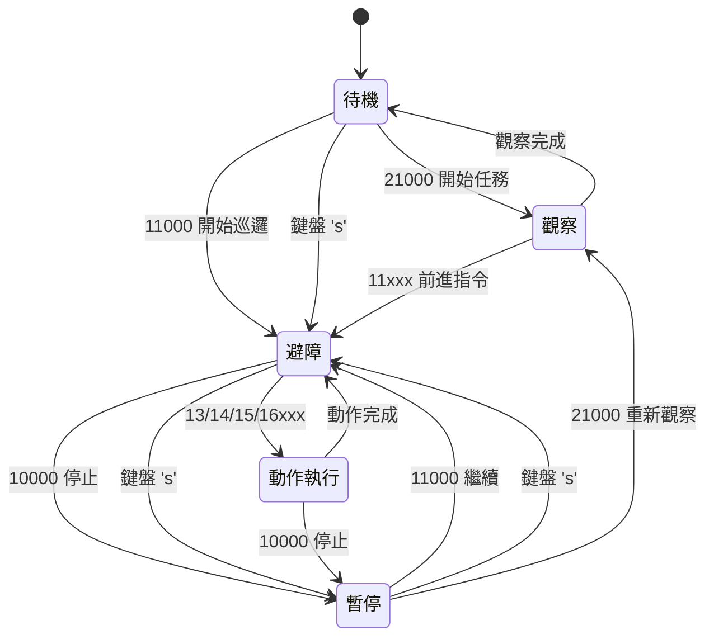

# 影像式模糊避障系統 — 技術實作文件

> **版本**: v4.1 (2025-12-26)  
> **平台**: Jetson Orin NX + ROS1 Noetic  
> **功能**: 基於 YOLO11 語義分割的道路追蹤與四輸入模糊控制避障系統

---

## 目錄

1. [系統概述](#1-系統概述)
2. [模組詳細說明](#2-模組詳細說明)
   - [2.1 道路檢測節點 (mod_predict_yolo11_trt.py)](#21-道路檢測節點)
   - [2.2 BEV 座標轉換模組 (mod_bev_transform.py)](#22-bev-座標轉換模組)
   - [2.3 模糊控制節點 (mod_fuzzy_control4.py)](#23-模糊控制節點)
   - [2.4 語音指令節點 (mod_voice_processing4.py)](#24-語音指令節點)
   - [2.5 整合控制節點 (integrated_control4.py)](#25-整合控制節點)
   - [2.6 相機標定工具 (calibrate_camera.py)](#26-相機標定工具)
3. [模糊控制規則設計](#3-模糊控制規則設計)
4. [ROS 通訊架構](#4-ros-通訊架構)
5. [狀態機與控制流程](#5-狀態機與控制流程)
6. [配置檔案說明](#6-配置檔案說明)
7. [系統啟動與運行](#7-系統啟動與運行)

---

## 1. 系統概述

本專案實現了一套基於視覺的機器人避障導航系統，核心技術包括：

| 技術領域 | 實現方式 |
|---------|---------|
| **目標檢測** | YOLO11n-seg 語義分割 + TensorRT 加速 |
| **座標轉換** | BEV (Bird's Eye View) 透視投影 |
| **決策控制** | 四輸入模糊邏輯控制器 (625 條規則) |
| **人機互動** | 語音指令 + 鍵盤控制雙模式 |
| **系統整合** | ROS1 Noetic 節點架構 |

### 1.1 系統架構圖

```
                   ┌─────────────────────────────────────────────────────────────┐
                   │                integrated_system.launch                      │
                   ├─────────────────────────────────────────────────────────────┤
                   │                                                               │
  ┌──────────┐     │  ┌─────────────────────┐   ┌─────────────────────┐         │
  │  Camera  │────▶│  │ mod_predict_yolo11  │   │  mod_fuzzy_control4 │         │
  │  (CSI)   │     │  │      _trt.py        │   │        .py          │         │
  └──────────┘     │  │                     │   │                     │         │
                   │  │ • YOLO11 分割       │   │ • 4-Input 模糊推論  │         │
                   │  │ • BEV 座標轉換      │──▶│ • EMA 低通濾波      │         │
                   │  │ • 誤差計算          │   │ • 速度命令輸出      │         │
                   │  └─────────────────────┘   └─────────────────────┘         │
                   │            │                          │                     │
  ┌──────────┐     │            │ /road_info               │ /fuzzy_cmd_vel      │
  │ Bluetooth│────▶│  ┌────────▼──────────────────────────▼─────────────┐       │
  │   Mic    │     │  │           integrated_control4.py                │       │
  └──────────┘     │  │                                                  │       │
        ▲          │  │  • 狀態機管理 (任務啟動/暫停/執行)              │       │
        │          │  │  • 語音/鍵盤控制連動                            │       │
        │          │  │  • 動作時序控制                                  │       │
  ┌─────┴────┐     │  └─────────────────────┬──────────────────────────┘       │
  │mod_voice │     │                        │ /cmd_vel                          │
  │processing│◀────│                        ▼                                   │
  │  4.py    │     │                 ┌──────────────┐                           │
  └──────────┘     │                 │   Robot Base │                           │
                   │                 │   (驅動器)   │                           │
                   │                 └──────────────┘                           │
                   └─────────────────────────────────────────────────────────────┘
```

---

## 2. 模組詳細說明

### 2.1 道路檢測節點

**檔案**: [mod_predict_yolo11_trt.py](file:///home/cir/ros/src/yolov7_ros/scripts/mod_predict_yolo11_trt.py)

#### 功能概述

- 使用 **YOLO11n-seg** 模型進行道路語義分割
- 透過 **TensorRT** 引擎加速推論
- 計算道路遮罩並找出參考點
- 發布道路資訊供模糊控制器使用

#### 核心類別

| 類別 | 職責 |
|-----|------|
| `GracefulKiller` | 優雅退出處理器，捕捉 SIGINT/SIGTERM |
| `YOLO11RoadDetector` | 主要檢測器，整合相機、模型、後處理 |

#### 關鍵方法

```python
class YOLO11RoadDetector:
    def predict(self, frame) -> results
        # YOLO11 推論，返回分割結果
        
    def process_masks(self, results, frame) -> tuple
        # 處理遮罩並找出雙參考點：
        # - forward_ref (藍色): 畫面中心與遮罩最高交點 (用於 e_d)
        # - lateral_ref (黃色): 固定高度的遮罩中心點 (用於 e_l)
        
    def draw_visualization(self, ...) -> annotated_frame
        # 繪製視覺化結果，包含 FPS 和參考點標記
```

#### 參考點計算邏輯

**前方距離參考點 (forward_ref)**:
- **目的**: 計算前方可行駛距離 (e_d)
- **方法**: 沿畫面水平中心線 (x = width/2) 往上搜尋，找到遮罩的最高點
- **視覺化**: 藍色圓點

**橫向誤差參考點 (lateral_ref)**:
- **目的**: 計算道路中心偏移量 (e_l)
- **方法**: 在固定的像素高度 (`lateral_ref_pixel_y`) 找該行的遮罩中心點
- **視覺化**: 黃色圓點

```python
# 橫向參考點距離設定 (第 544 行)
lateral_ref_distance = 1.1  # 公尺 (對應像素 y 座標由 BEV 計算)
```

#### 發布的 ROS 消息

**Topic**: `/road_info` (Float32MultiArray)

| 索引 | 欄位 | 說明 |
|-----|------|------|
| 0 | road_detected | 是否偵測到道路 (0/1) |
| 1 | e_d | 前方距離誤差 (m) |
| 2 | e_d_dot | 前方距離變化率 (m/s) |
| 3 | e_l | 橫向誤差 (m) |
| 4 | e_l_dot | 橫向變化率 (m/s) |
| 5 | y_ground | 前方距離絕對值 (m) |
| 6 | x_ground | 橫向距離絕對值 (m) |

#### GStreamer Pipeline

```python
def gstreamer_pipeline(sensor_id=0, capture_width=640, capture_height=480, framerate=30):
    return (
        "v4l2src device=/dev/video%d ! "
        "video/x-raw, width=(int)%d, height=(int)%d, framerate=(fraction)%d/1 ! "
        "videoconvert ! video/x-raw, format=(string)BGR ! appsink"
    )
```

> [!NOTE]
> 在 Jetson 上使用 GStreamer 可確保 CSI 相機以正確解析度運行。

---

### 2.2 BEV 座標轉換模組

**檔案**: [mod_bev_transform.py](file:///home/cir/ros/src/yolov7_ros/scripts/mod_bev_transform.py)

#### 功能概述

- 將影像像素座標轉換為地面實際座標 (公尺)
- 實現透視投影幾何計算
- 計算模糊控制器所需的四個誤差值

#### 座標轉換原理

```
                相機座標系                          地面座標系
                
                   ▲ Y (光軸)                         ▲ Y (前方)
                   │                                   │
                   │  θ (俯仰角)                       │
                   │ ╱                                 │
                   │╱                                  │
         ─────────●───────▶ X                ◀────────●────────▶ X
                 ╱                            (左)     機器人    (右)
                ╱
               ▼ Z (向下)


  轉換公式:
  ────────────────────────────────────────────────────────────────
  total_pitch = pitch_rad + arctan2(v - cy, fy)    # 總俯仰角
  y_ground = camera_height / tan(total_pitch)      # 前方距離
  x_ground = slant_distance * tan(alpha)           # 橫向距離
```

#### 核心類別

```python
class BEVTransformer:
    def __init__(self, config_path=None):
        # 載入相機配置 (內外參)
        # 預計算旋轉矩陣與校正係數
        
    def pixel_to_ground(self, u, v) -> (x_ground, y_ground):
        # 像素座標 → 地面座標 (公尺)
        
    def distance_to_pixel_y(self, distance_m) -> pixel_y:
        # 地面距離 → 像素 y 座標 (逆計算)
        
    def compute_errors(self, forward_ref, lateral_ref) -> dict:
        # 計算四個誤差值: e_d, e_d_dot, e_l, e_l_dot
```

#### 距離校正

由於透視投影的非線性，原始計算值與實際距離有誤差，使用多項式校正：

```python
# 垂直距離校正 (二次多項式)
# actual = a*d² + b*d + c
distance_correction_coeffs = [-0.0921, 1.0379, 0.1030]

# 水平距離校正 (線性)
# factor = a*y + b
lateral_correction_a = -0.1613
lateral_correction_b = 1.0051
```

#### BEV 視覺化

`create_bev_visualization()` 方法產生鳥瞰圖視窗，顯示：

- 機器人位置 (底部中央綠色方塊)
- 停止線 (紅色水平線)
- 距離網格 (每 0.5m)
- 模糊隸屬函數區域：
  - e_d 範圍: 水平色帶 (VN=紅, N=橙, M=黃, F=綠)
  - e_l 範圍: 垂直線 (NB, NS, PS, PB)
  - ZO 區域: 半透明綠色中央區

---

### 2.3 模糊控制節點

**檔案**: [mod_fuzzy_control4.py](file:///home/cir/ros/src/yolov7_ros/scripts/mod_fuzzy_control4.py)

#### 功能概述

- 實現四輸入、二輸出的模糊邏輯控制器
- 載入 CSV 格式的模糊規則 (625 條)
- 輸出線速度 (v) 和角速度 (ω)

#### 輸入/輸出規格

| 變數 | 符號 | 範圍 | 單位 | 語言變數 |
|-----|------|------|-----|---------|
| 前方距離誤差 | e_d | [0, 2.08] | m | VN, N, M, F, VF |
| 距離變化率 | e_d_dot | [-2.08, 2.08] | m/s | NB, NS, ZO, PS, PB |
| 橫向誤差 | e_l | [-0.5, 0.5] | m | NB, NS, ZO, PS, PB |
| 橫向變化率 | e_l_dot | [-1.0, 1.0] | m/s | NB, NS, ZO, PS, PB |
| **線速度** | v | {0, 0.15, 0.3, 0.45, 0.6} | m/s | S, VS, SL, M, F |
| **角速度** | ω | {-1.5, -0.75, 0, 0.75, 1.5} | rad/s | NB, NS, ZO, PS, PB |

#### 隸屬函數 (三角形)

```python
class MembershipFunctions:
    # 前方距離誤差 e_d [0, 2.08]
    E_D = {
        'VN': (0.0, 0.0, 0.52),      # Very Near
        'N':  (0.0, 0.52, 1.04),     # Near
        'M':  (0.52, 1.04, 1.56),    # Medium
        'F':  (1.04, 1.56, 2.08),    # Far
        'VF': (1.56, 2.08, 2.08)     # Very Far
    }
    
    # 橫向誤差 e_l [-0.5, 0.5] - 加大死區
    E_L = {
        'NB': (-1.0, -0.5, -0.25),   # 左偏大
        'NS': (-0.5, -0.25, 0.0),    # 左偏小
        'ZO': (-0.25, 0.0, 0.25),    # 置中 (死區)
        'PS': (0.0, 0.25, 0.5),      # 右偏小
        'PB': (0.25, 0.5, 1.0)       # 右偏大
    }
```

#### 模糊推論流程

```
輸入 (e_d, e_d_dot, e_l, e_l_dot)
        │
        ▼
┌───────────────────┐
│   1. 模糊化        │   計算各輸入的隸屬度
│   (Fuzzification) │   mu_e_d[VN,N,M,F,VF]
└─────────┬─────────┘   mu_e_l[NB,NS,ZO,PS,PB] ...
          │
          ▼
┌───────────────────┐
│   2. 規則評估      │   625 條規則 (5^4)
│   (Rule Eval)     │   firing_strength = min(mu_1, mu_2, mu_3, mu_4)
└─────────┬─────────┘
          │
          ▼
┌───────────────────┐
│   3. 聚合         │   加權平均
│   (Aggregation)   │   v = Σ(strength × V_singleton) / Σ(strength)
└─────────┬─────────┘
          │
          ▼
┌───────────────────┐
│   4. 距離增益      │   距離越近，轉向增益越大
│   (Distance Gain) │   gain = 1.0 + (1 - e_d/2.08) * 0.25
└─────────┬─────────┘
          │
          ▼
┌───────────────────┐
│   5. 低通濾波      │   EMA 濾波減少頓挫
│   (LPF)           │   v_out = α*v + (1-α)*v_prev
└─────────┬─────────┘
          │
          ▼
輸出 (v, omega)
```

#### 低通濾波器

使用指數移動平均 (EMA) 減緩控制頓挫：

```python
# 濾波係數
alpha_v = 0.4      # 線速度
alpha_omega = 0.6  # 角速度

# 濾波公式
v_filtered = alpha_v * v_current + (1 - alpha_v) * v_prev
omega_filtered = alpha_omega * omega_current + (1 - alpha_omega) * omega_prev
```

| 調整方向 | 效果 |
|---------|------|
| alpha ↓ | 濾波增強，更平滑，反應變慢 |
| alpha ↑ | 濾波減弱，反應變快，可能抖動 |

---

### 2.4 語音指令節點

**檔案**: [mod_voice_processing4.py](file:///home/cir/ros/src/yolov7_ros/scripts/mod_voice_processing4.py)

#### 功能概述

- 透過藍牙麥克風錄製語音
- VAD (Voice Activity Detection) 智能錄音
- 雲端語音辨識 API 呼叫
- 指令編碼解析與發布

#### 指令編碼格式

編碼為 **5 位數字**: `[設備碼 1位][動作碼 1位][參數碼 3位]`

**設備 1 — 載具控制**:

| 動作碼 | 語音指令 | 編碼範例 |
|-------|---------|---------|
| 0 | 暫停待命 | 10000 |
| 1 | 開始前進 | 11000 |
| 3 | 左轉 | 13000, 13130 (30°) |
| 4 | 右轉 | 14000, 14145 (45°) |
| 5 | 左轉往前 | 15000, 15201 (到傷患) |
| 6 | 右轉往前 | 16000, 16205 (到廁所) |

**設備 2 — 攝影機** (含特殊載具指令):

| 編碼 | 說明 |
|-----|------|
| 21000 | 左右觀察 (載具執行左右轉90°) |
| 23XXX | 鏡頭往左 |
| 24XXX | 鏡頭往右 |

**位置參數碼**:

| 參數 | 位置 |
|-----|------|
| 01 | 傷患 |
| 02 | 斜坡 |
| 03 | 門口 |
| 04 | 轉角處 |
| 05 | 廁所 |
| 06 | 電梯 |
| 07 | 樓梯 |

#### VAD 錄音參數

```python
SILENCE_THRESHOLD = 1000     # RMS 靜音閾值
SPEECH_START_THRESHOLD = 5   # 連續語音塊數開始錄音
SPEECH_END_THRESHOLD = 10    # 連續靜音塊數結束錄音
MAX_RECORDING_SECONDS = 5    # 最長錄音時間
```

#### 語音處理流程

```
麥克風輸入
    │
    ▼
┌─────────────────┐
│  VAD 智能錄音    │   計算 RMS，偵測語音起止
└────────┬────────┘
         │
         ▼
┌─────────────────┐
│  noisereduce    │   取前 0.5 秒作為噪聲樣本降噪
└────────┬────────┘
         │
         ▼
┌─────────────────┐
│  轉 MP3 + Base64│   pydub 轉檔，Base64 編碼
└────────┬────────┘
         │
         ▼
┌─────────────────┐
│  雲端 API 辨識   │   POST 到 ngrok 語音服務
└────────┬────────┘
         │
         ▼
發布 /voice_command_code
```

#### 測試模式

設定 `test_mode:=true` 時，可用鍵盤模擬語音指令：

| 鍵 | 模擬編碼 | 動作 |
|---|---------|------|
| 0 | 10000 | 停止 |
| 1 | 21000 | 開始任務/左右觀察 |
| 2 | 11000 | 前進 |
| 3 | 13000 | 左轉 90° |
| 4 | 14000 | 右轉 90° |
| 5 | 15000 | 左轉後前進 |
| 6 | 16000 | 右轉後前進 |

---

### 2.5 整合控制節點

**檔案**: [integrated_control4.py](file:///home/cir/ros/src/yolov7_ros/scripts/integrated_control4.py)

#### 功能概述

- 統一管理所有輸入來源 (模糊控制、語音指令、鍵盤)
- 實現狀態機控制邏輯
- 輸出最終馬達速度命令

#### 狀態變數

| 變數 | 型別 | 說明 |
|-----|------|------|
| task_started | bool | 任務是否已啟動 |
| avoid_obstacle | bool | 避障功能是否啟用 |
| keyboard_avoidance_enabled | bool | 鍵盤控制的避障開關 |
| paused | bool | 是否完全暫停 |
| is_executing_voice_cmd | bool | 是否正在執行語音指令 |
| cmd_executing | bool | 是否有動作正在執行 |

#### 運動參數

```python
DEGREE_TO_RADIAN = 0.0174533   # π/180
LINEAR_SPEED = 0.3             # 前進速度 (m/s)
ANGULAR_SPEED = 1.0            # 旋轉速度 (rad/s)
```

#### 動作執行方法

| 方法 | 編碼 | 說明 |
|-----|-----|------|
| `left_right_observation()` | 21000 | 左90°→停→右180°→停→左90° |
| `turn_left()` / `turn_right()` | 13000/14000 | 原地轉90° |
| `turn_left_degrees(n)` | 131XX | 原地轉n度 |
| `move_forward_distance(d)` | 111XX | 前進d公尺 |
| `turn_left_then_forward()` | 15000 | 轉90°後啟動避障 |

#### 主循環邏輯

```python
def run(self):
    while not rospy.is_shutdown():
        # 1. 檢查語音指令超時 (安全機制)
        self.check_voice_cmd_timeout()
        
        # 2. 檢查當前動作是否完成
        self.check_command_completion()
        
        # 3. 三種運行狀態
        if self.paused:
            pass  # 完全暫停
            
        elif self.is_executing_voice_cmd and self.cmd_executing:
            self.process_current_command()  # 執行語音動作
            
        elif keyboard_enabled or (task_started and avoid_obstacle):
            if self.road_detected:
                self.cmd_vel_pub.publish(self.fuzzy_cmd)  # 模糊控制
            else:
                self.stop_robot()
```

---

### 2.6 相機標定工具

**檔案**: [calibrate_camera.py](file:///home/cir/ros/src/yolov7_ros/scripts/calibrate_camera.py)

#### 功能概述

- 使用棋盤格圖案進行相機內參標定
- 自動儲存結果到 `camera_config.yaml`
- 支援即時去畸變預覽

#### 使用步驟

1. 列印 9×6 棋盤格 (方格 25mm)
2. 執行 `python3 calibrate_camera.py`
3. 將棋盤格放置在不同位置角度，按 `s` 擷取
4. 擷取 15-20 張後，按 `c` 執行標定
5. 結果自動儲存

#### 快捷鍵

| 鍵 | 功能 |
|---|------|
| s | 擷取當前幀 |
| c | 執行標定計算 |
| u | 切換去畸變顯示 |
| q | 離開 |

---

## 3. 模糊控制規則設計

**規則檔案**: [fuzzy_rules_relaxed.csv](file:///home/cir/ros/src/yolov7_ros/src/fuzzy_control_design/fuzzy_rules_relaxed.csv)

#### 規則結構

- **總規則數**: 625 條 (5^4)
- **輸入組合**: e_d × e_d_dot × e_l × e_l_dot
- **輸出**: v (線速度), ω (角速度)

#### 規則設計原則

| 情境 | e_d | e_l | v | ω |
|-----|-----|-----|---|---|
| 距離近、置中 | VN | ZO | S (停止) | ZO (直行) |
| 距離遠、置中 | VF | ZO | F (快速) | ZO (直行) |
| 距離中、左偏 | M | NB | SL (慢) | PB (右修正) |
| 距離中、右偏 | M | PB | SL (慢) | NB (左修正) |
| 快速接近 | N | - | VS | - |
| 快速遠離 | F | - | M | - |

#### CSV 格式

```csv
Rule_ID,e_d,e_d_dot,e_l,e_l_dot,v,omega
1,VN,NB,NB,NB,S,PB
2,VN,NB,NB,NS,S,PB
...
625,VF,PB,PB,PB,M,NS
```

---

## 4. ROS 通訊架構

### 4.1 Topic 列表

| Topic | 類型 | 發布者 | 訂閱者 | 說明 |
|-------|------|--------|--------|------|
| `/road_info` | Float32MultiArray | road_detection | fuzzy_controller, integrated_controller | 道路誤差資訊 |
| `/fuzzy_cmd_vel` | Twist | fuzzy_controller | integrated_controller | 模糊控制速度命令 |
| `/voice_command_code` | String | voice_command | integrated_controller, fuzzy_controller | 語音指令編碼 |
| `/avoidance_enabled` | String | road_detection, integrated_controller | integrated_controller, fuzzy_controller | 鍵盤控制避障開關 |
| `/system_status` | String | integrated_controller | voice_command, fuzzy_controller | 系統狀態 |
| `/cmd_vel` | Twist | integrated_controller | 機器人底盤 | 最終速度命令 |

### 4.2 消息流向

```
mod_predict_yolo11_trt
        │
        ├──▶ /road_info ──────────────────────┬──▶ mod_fuzzy_control4
        │                                      │           │
        └──▶ /avoidance_enabled ───┐           │           │
                                   │           │           ▼
mod_voice_processing4              │           │    /fuzzy_cmd_vel
        │                          │           │           │
        └──▶ /voice_command_code ──┼───────────┤           │
                                   │           │           │
                                   ▼           ▼           ▼
                              integrated_control4
                                      │
                                      ▼
                                  /cmd_vel ──▶ Robot Base
```

---

## 5. 狀態機與控制流程

### 5.1 系統狀態

| 狀態 | task_started | avoid_obstacle | paused | 行為 |
|-----|-------------|----------------|--------|------|
| 待機 | False | False | False | 等待啟動指令 |
| 觀察 | True | False | False | 執行左右觀察 |
| 避障 | True | True | False | 模糊控制導航 |
| 暫停 | True | False | True | 完全停止 |
| 動作執行 | True | - | False | 執行語音動作 |

### 5.2 狀態轉換圖



### 5.3 鍵盤與語音連動

- 鍵盤按 **'s'** 啟動避障時，同步設定 `keyboard_avoidance_enabled = True`
- 語音說 **「開始巡邏」** 時，同步發布 `/avoidance_enabled: enabled`
- 任一方停止時，另一方也會連動停止

---

## 6. 配置檔案說明

### 6.1 camera_config.yaml

**路徑**: [config/camera_config.yaml](file:///home/cir/ros/src/yolov7_ros/config/camera_config.yaml)

```yaml
# 相機外參
camera_extrinsics:
  height_m: 0.60          # 相機安裝高度 (公尺)
  pitch_deg: 29.0         # 俯仰角 (度，向下為正)
  offset_from_robot_front_m: -0.15  # 相機與機器人前緣偏移

# 相機內參 (由標定工具產生)
camera_intrinsics:
  width: 640
  height: 480
  fx: 519.25              # 焦距 x
  fy: 519.25              # 焦距 y
  cx: 316.49              # 主點 x
  cy: 211.29              # 主點 y
  distortion: [...]       # 畸變係數

# 安全參數
safety:
  stop_distance_m: 1.04   # 安全停止距離

# 感測範圍
sensing_range:
  min_distance_from_camera_m: 0.45  # 最近可視距離
  max_distance_from_camera_m: 3.25  # 最遠可視距離

# 模糊控制範圍
fuzzy_ranges:
  e_d_min: 0.0
  e_d_max: 2.08
  e_l_min: -0.5
  e_l_max: 0.5
```

### 6.2 integrated_system.launch

**路徑**: [launch/integrated_system.launch](file:///home/cir/ros/src/yolov7_ros/launch/integrated_system.launch)

```xml
<launch>
  <param name="use_sim_time" value="false" />

  <!-- 道路檢測節點 -->
  <node name="road_detection_node" pkg="yolov7_ros" 
        type="mod_predict_yolo11_trt.py" output="screen" />

  <!-- 模糊控制節點 -->
  <node name="fuzzy_controller_node" pkg="yolov7_ros" 
        type="mod_fuzzy_control4.py" output="screen" />

  <!-- 語音指令節點 -->
  <node name="voice_command_node" pkg="yolov7_ros" 
        type="mod_voice_processing4.py" output="screen">
    <param name="test_mode" value="false" />
  </node>

  <!-- 整合控制節點 -->
  <node name="integrated_controller_node" pkg="yolov7_ros" 
        type="integrated_control4.py" output="screen" />

  <!-- 模糊控制資料記錄器 (可選) -->
  <arg name="enable_logger" default="true" />
  <node name="fuzzy_data_logger" pkg="yolov7_ros" 
        type="fuzzy_data_logger.py" output="screen" 
        if="$(arg enable_logger)" />
</launch>
```

---

## 7. 系統啟動與運行

### 7.1 快速啟動

```bash
# 完整系統
roslaunch yolov7_ros integrated_system.launch

# 測試模式 (語音用鍵盤模擬)
roslaunch yolov7_ros integrated_system.launch test_mode:=true

# 停用資料記錄器
roslaunch yolov7_ros integrated_system.launch enable_logger:=false
```

### 7.2 操作方式

| 操作 | 方法 |
|-----|------|
| 啟動避障 | 在 YOLO 視窗按 **'s'** 或 語音「開始巡邏」 |
| 停止避障 | 按 **'s'** 或 語音「暫停、待命」 |
| 左右觀察 | 語音「觀察環境」或 測試模式按 **'1'** |
| 左/右轉 | 語音「左轉/右轉」 |
| 退出程式 | 在任意視窗按 **'q'** |

### 7.3 調試指令

```bash
# 查看道路資訊
rostopic echo /road_info

# 查看模糊控制輸出
rostopic echo /fuzzy_cmd_vel

# 查看系統狀態
rostopic echo /system_status

# 查看節點圖
rqt_graph
```

### 7.4 常見問題

| 問題 | 可能原因 | 解決方法 |
|-----|---------|---------|
| 鍵盤無反應 | 視窗無焦點 | 點擊 YOLO 視窗 |
| 機器人不動 | 未啟動避障 | 確認 task_started=True |
| 轉向過度 | 角速度增益過大 | 調整 distance_gain 或 alpha_omega |
| 來回擺動 | 濾波不足 | 降低 alpha_omega |
| 語音失敗 | 網路問題 | 檢查 ngrok URL |

---

> **文件版本**: v4.1  
> **最後更新**: 2025-12-26  
> **維護者**: AMRR Project Team
