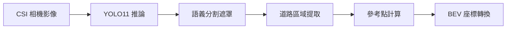
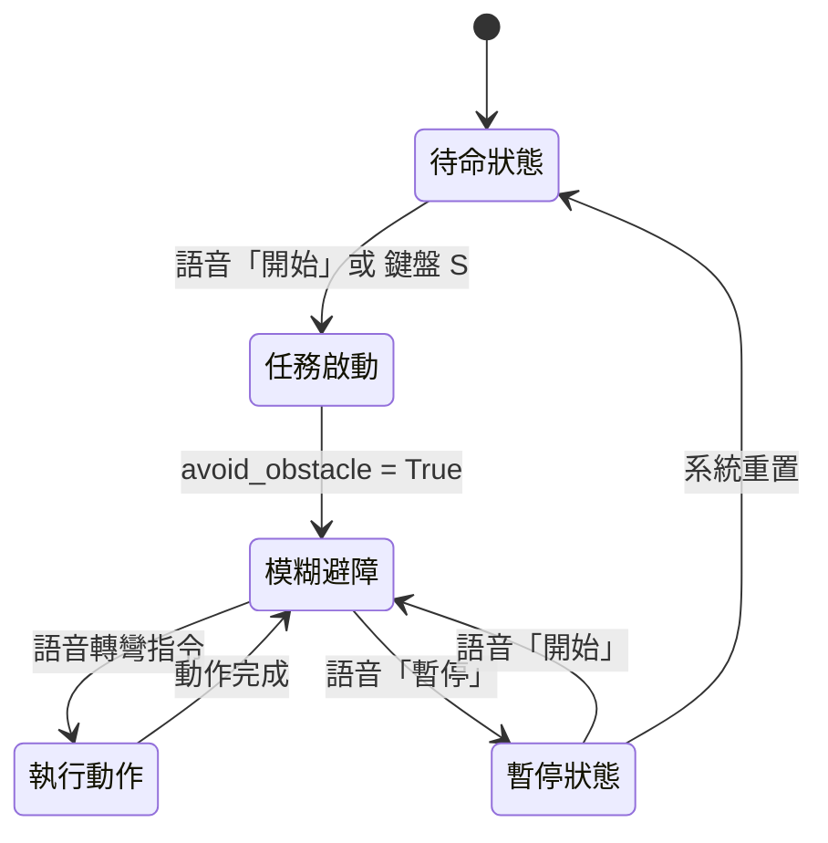
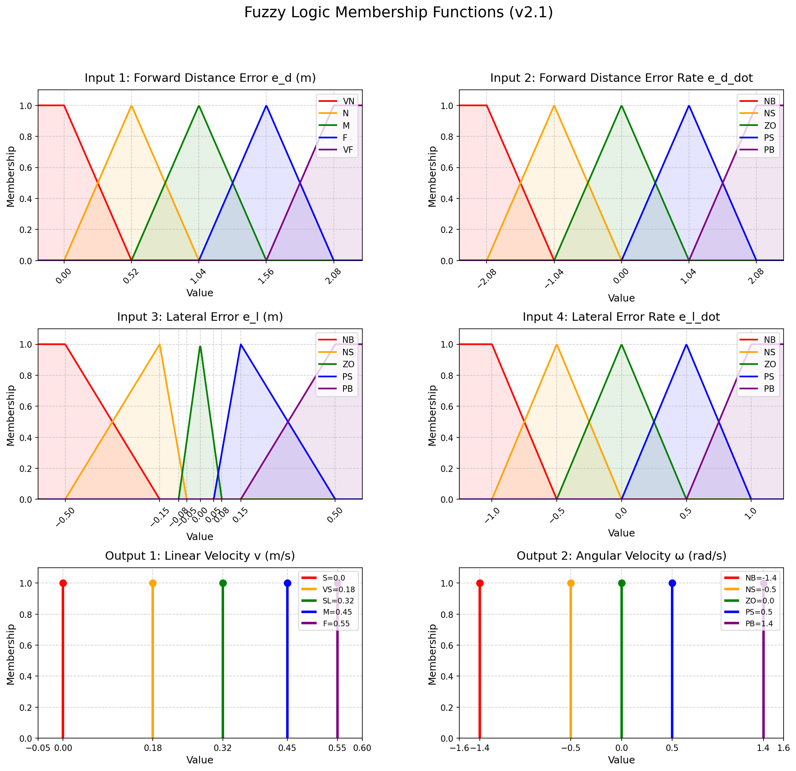

# 視覺模糊避障結合語音控制系統 - 論文分析文件

> **版本**：v1.0 (2026-01-09)  
> **平台**：Jetson Orin NX + ROS1 Noetic  
> **用途**：論文撰寫參考資料

---

## 摘要

本系統提出一種**基於深度學習語義分割與模糊邏輯控制**的自主移動機器人避障方法，結合**語音人機介面**實現自然語言指令控制。系統採用 YOLO11n-seg 進行即時道路分割，透過鳥瞰圖（BEV）座標轉換計算誤差值，並以**四輸入二輸出模糊控制器**決策線速度與角速度。實驗結果顯示，本方法在障礙物避障成功率達 **100%**，路徑效率指標 SPL 達 **0.9457**。

---

## 1. 系統架構

### 1.1 整體架構圖

```
┌─────────────────────────────────────────────────────────────────────────────┐
│                        ROS1 Noetic 系統架構                                  │
│                                                                              │
│  ┌────────────────┐  ┌────────────────┐  ┌────────────────┐                 │
│  │   感知層       │  │   決策層       │  │   人機介面層   │                 │
│  │ road_detection │  │ fuzzy_controller│  │ voice_command  │                 │
│  │     _node      │  │      _node     │  │     _node      │                 │
│  └───────┬────────┘  └───────┬────────┘  └───────┬────────┘                 │
│          │ /road_info        │ /fuzzy_cmd_vel    │ /voice_command_code      │
│          │                   │                   │                          │
│          └───────────────────┼───────────────────┘                          │
│                              ▼                                              │
│                   ┌──────────────────────────┐                              │
│                   │      控制整合層          │                              │
│                   │ integrated_controller    │                              │
│                   │         _node            │                              │
│                   └────────────┬─────────────┘                              │
│                                │ /cmd_vel                                   │
│                                ▼                                            │
│                   ┌──────────────────────────┐                              │
│                   │      運動執行層          │                              │
│                   │    差速驅動機器人底盤     │                              │
│                   └──────────────────────────┘                              │
└─────────────────────────────────────────────────────────────────────────────┘
```

### 1.2 軟硬體規格

| 項目 | 規格 |
|------|------|
| **運算平台** | NVIDIA Jetson Orin NX 16GB |
| **相機** | CSI 相機，640×480 @ 30fps |
| **深度學習框架** | YOLO11n-seg + TensorRT 加速 |
| **作業系統** | Ubuntu 20.04 + ROS Noetic |
| **語音輸入** | 藍牙麥克風 + 雲端語音辨識 API |

---

## 2. 感知模組：YOLO11 語義分割與 BEV 轉換

### 2.1 道路分割 (Road Segmentation)

#### 2.1.1 模型規格

| 參數 | 數值 |
|------|------|
| 模型架構 | YOLO11n-seg |
| 推論引擎 | TensorRT |
| 輸入解析度 | 640×640 (letterbox) |
| 置信度閾值 | 0.5 |
| 最大檢測數 | 1 (max_det=1) |
| 平均 FPS | 15-20 fps |

#### 2.1.2 處理流程



### 2.2 鳥瞰圖座標轉換 (BEV Transform)

#### 2.2.1 原理

採用**幾何投影法**，將相機影像像素座標轉換為地面實際座標（公尺）。

**相機模型假設：**
- 相機安裝高度：$h = 0.60$ m
- 俯仰角（向下）：$\theta = 29°$
- 主點：$(c_x, c_y) = (320, 240)$
- 焦距：$(f_x, f_y) = (457.1, 458.4)$

**像素到地面座標轉換公式：**

$$
\alpha = \arctan\left(\frac{u - c_x}{f_x}\right), \quad
\beta = \arctan\left(\frac{v - c_y}{f_y}\right)
$$

$$
y_{ground} = \frac{h}{\tan(\theta + \beta)}, \quad
x_{ground} = \frac{h}{\sin(\theta + \beta)} \cdot \tan(\alpha)
$$

#### 2.2.2 雙參考點設計

本系統採用**分離式參考點**設計，解決前方距離與橫向誤差的解耦問題：

| 參考點 | 用途 | 像素位置 | 物理意義 |
|--------|------|----------|----------|
| **前方參考點** (藍色) | 計算 $e_d$ | 畫面中心垂直線與遮罩交點 | 道路可視終點距離 |
| **橫向參考點** (黃色) | 計算 $e_l$ | 固定 y=停止距離處的遮罩中心 | 橫向偏移量 |

### 2.3 誤差變數定義

| 變數 | 定義 | 範圍 | 物理意義 |
|------|------|------|----------|
| $e_d$ | 前方距離誤差 | $[0, 2.08]$ m | 距停止距離的餘裕 |
| $\dot{e_d}$ | 前方距離變化率 | $[-2.08, 2.08]$ m/s | 接近/遠離速度 |
| $e_l$ | 橫向誤差 | $[-0.5, 0.5]$ m | 左(-)/右(+)偏移 |
| $\dot{e_l}$ | 橫向變化率 | $[-1.0, 1.0]$ m/s | 偏移速度 |

---

## 3. 決策模組：四輸入模糊控制器

### 3.1 模糊控制器架構

```
                 ┌─────────┐
    e_d    ──────│         │
    ė_d    ──────│  模糊   │────── v (線速度)
    e_l    ──────│  推論   │────── ω (角速度)
    ė_l    ──────│  系統   │
                 └─────────┘
                      │
           ┌──────────┼──────────┐
           │          │          │
       ┌───▼───┐  ┌───▼───┐  ┌───▼───┐
       │模糊化 │  │規則庫 │  │解模糊 │
       │       │  │625條  │  │加權平均│
       └───────┘  └───────┘  └───────┘
```

### 3.2 隸屬函數設計

#### 3.2.1 輸入變數隸屬函數

**前方距離誤差 $e_d$（三角形/梯形）：**

| 語言變數 | 參數 (a, b, c) | 物理意義 |
|----------|----------------|----------|
| VN (Very Near) | (0.0, 0.0, 0.52) | 危險區域 |
| N (Near) | (0.0, 0.52, 1.04) | 接近停止距離 |
| M (Medium) | (0.52, 1.04, 1.56) | 正常行駛區域 |
| F (Far) | (1.04, 1.56, 2.08) | 安全距離 |
| VF (Very Far) | (1.56, 2.08, 2.08) | 視野良好 |

**橫向誤差 $e_l$（非對稱死區設計）：**

| 語言變數 | 參數 (a, b, c) | 設計特點 |
|----------|----------------|----------|
| NB | (-0.5, -0.5, -0.15) | 左偏大 |
| NS | (-0.5, -0.15, -0.05) | 終點 -0.05 創造死區 |
| ZO | (-0.08, 0.0, 0.08) | 擴大死區 ±0.08m |
| PS | (0.05, 0.15, 0.5) | 起點 0.05 創造死區 |
| PB | (0.15, 0.5, 0.5) | 右偏大 |

> **死區設計理由**：避免微小擾動觸發不必要的轉向修正，提高直行穩定性。

#### 3.2.2 輸出變數隸屬函數（Singleton）

**線速度 $v$：**

| 語言變數 | 數值 (m/s) | 設計考量 |
|----------|-----------|----------|
| S (Stop) | 0.00 | 緊急停止 |
| VS (Very Slow) | 0.18 | 近距離緩行 |
| SL (Slow) | 0.32 | 偏移時減速 |
| M (Medium) | 0.45 | 正常行駛 |
| F (Fast) | 0.55 | 遠距離直行 |

**角速度 $\omega$：**

| 語言變數 | 數值 (rad/s) | 設計考量 |
|----------|-------------|----------|
| NB | -1.4 | 大幅右轉 |
| NS | -0.5 | 小幅右轉 |
| ZO | 0.0 | 直行 |
| PS | 0.5 | 小幅左轉 |
| PB | 1.4 | 大幅左轉 |

### 3.3 模糊規則設計

#### 3.3.1 規則數量

$$
5^4 = 625 \text{ 條規則}
$$

#### 3.3.2 規則產生邏輯

採用**分階段合成法**：

1. **階段 1：基準規則**
   - 線速度基準：$v_{base} = f(e_d, \dot{e_d})$
   - 角速度基準：$\omega_{base} = f(e_l, \dot{e_l})$

2. **階段 2：交互作用修正**
   - 線速度修正（受 $e_l$ 影響）：大偏移時降速
   - 角速度修正（受 $e_d$ 影響）：低速時減少角速度

**線速度基準規則表：**

| $e_d \backslash \dot{e_d}$ | NB | NS | ZO | PS | PB |
|:---:|:---:|:---:|:---:|:---:|:---:|
| VN | S | S | S | VS | VS |
| N | S | VS | VS | SL | SL |
| M | SL | SL | SL | M | F |
| F | SL | M | M | F | F |
| VF | M | M | F | F | F |

**角速度基準規則表：**

| $e_l \backslash \dot{e_l}$ | NB | NS | ZO | PS | PB |
|:---:|:---:|:---:|:---:|:---:|:---:|
| NB | PB | PB | PB | PS | PS |
| NS | PB | PB | PS | PS | PS |
| ZO | PS | PS | ZO | NS | NS |
| PS | NS | NS | NS | NB | NB |
| PB | NS | NS | NB | NB | NB |

### 3.4 模糊推論方法

#### 3.4.1 模糊化 (Fuzzification)

計算輸入值在各語言變數的隸屬度：

$$
\mu_{e_d}(x) = \text{triangular\_mf}(x; a, b, c)
$$

#### 3.4.2 規則評估 (Rule Evaluation)

採用 **AND 運算（最小值）** 計算規則激發強度：

$$
w_i = \min(\mu_{e_d}, \mu_{\dot{e_d}}, \mu_{e_l}, \mu_{\dot{e_l}})
$$

#### 3.4.3 解模糊化 (Defuzzification)

採用 **加權平均法 (Weighted Average Method)**：

$$
y = \frac{\sum_{i=1}^{N} w_i \cdot c_i}{\sum_{i=1}^{N} w_i}
$$

其中 $c_i$ 為第 $i$ 條規則的輸出 Singleton 值。

> **選用理由**：計算效率高，適合實時控制系統。

### 3.5 後處理設計

#### 3.5.1 輸出範圍限制

```python
v = np.clip(v, 0.0, 0.55)        # 線速度上限 0.55 m/s
omega = np.clip(omega, -1.4, 1.4)  # 角速度上限 ±1.4 rad/s
```

#### 3.5.2 低通濾波器 (EMA)

採用**指數移動平均 (Exponential Moving Average)** 消除高頻抖動：

$$
y_t = \alpha \cdot x_t + (1 - \alpha) \cdot y_{t-1}
$$

| 參數 | 數值 | 濾波強度 | 設計理由 |
|------|------|----------|----------|
| $\alpha_v$ | 0.2 | 強 | 消除線速度猶豫，平滑加減速 |
| $\alpha_\omega$ | 0.3 | 中 | 保留轉向靈敏度，減少擺動 |

---

## 4. 人機介面：語音指令控制

### 4.1 語音處理流程


### 4.2 語音指令編碼表

| 編碼 | 語音指令 | 動作 |
|------|----------|------|
| 11000 | 開始巡邏 / 向前進 | 啟動模糊避障 |
| 10000 | 暫停、待命 | 停止機器人 |
| 21000 | 觀察環境 | 左右轉頭 90° |
| 13000 | 左轉 | 左轉 90° |
| 14000 | 右轉 | 右轉 90° |
| 15000 | 左轉向前 | 左轉 90° → 啟動避障 |
| 16000 | 右轉向前 | 右轉 90° → 啟動避障 |

### 4.3 VAD (Voice Activity Detection) 算法

採用 **RMS (均方根)** 音量閾值判斷語音活動：

```python
def calculate_rms(data):
    shorts = np.frombuffer(data, dtype=np.int16)
    return np.sqrt(np.mean(np.square(shorts.astype(np.float64))))
```

| 參數 | 數值 | 說明 |
|------|------|------|
| SILENCE_THRESHOLD | 1000 | 靜音閾值 |
| SPEECH_START_THRESHOLD | 5 | 連續超閾值幀數開始錄音 |
| SPEECH_END_THRESHOLD | 10 | 連續低於閾值幀數結束錄音 |
| MAX_RECORDING_SECONDS | 5 | 最大錄音時間 |

---

## 5. 整合控制：狀態機設計

### 5.1 狀態機架構



### 5.2 控制優先級

1. **語音指令優先**：執行中的語音動作不可被模糊控制覆蓋
2. **鍵盤連動**：語音與鍵盤控制雙向連動
3. **安全機制**：超時自動恢復模糊控制

---

## 6. 實驗設計與結果

### 6.1 實驗環境

- **場地**：室內走廊，寬度約 1.5m
- **障礙物**：3 個固定位置障礙箱
- **路徑長度**：約 7m

### 6.2 評估指標

| 指標類別 | 指標名稱 | 計算方式 |
|----------|----------|----------|
| **幾何準確性** | ATE RMSE | 絕對軌跡誤差均方根 |
| | Hausdorff Distance | 最壞偏差 |
| | Fréchet Distance | 形狀相似度 |
| **導航效率** | SPL | Success weighted Path Length |
| | Success Rate | 避障成功率 |
| **運動平滑度** | Average Jerk | 加速度變化率均值 |
| | Curvature | 路徑曲率 |
| **動態安全性** | Minimum Distance | 最小障礙物距離 |
| | Collision Probability | 碰撞機率 |

### 6.3 實驗結果

#### 6.3.1 視覺模糊控制性能

| 指標 | 數值 | 評價 |
|------|------|------|
| ATE RMSE | 0.1873 ± 0.0456 m | 良好 |
| Hausdorff Distance | 0.3594 m | 可接受 |
| SPL | 0.9457 ± 0.0132 | **優秀** |
| Success Rate | **100%** | **完美** |
| Travel Time | 20.11 s | - |
| Path Length | 7.18 m | - |
| Average Jerk | 0.3482 m/s³ | 平滑 |
| Minimum Distance | 0.3379 m | 安全 |
| Collision Probability | **0%** | **完美** |

#### 6.3.2 與 Lidar 方法比較（障礙物高度降低場景）

| 項目 | Lidar 方法 | 視覺模糊方法 |
|------|------------|--------------|
| **結果** | ❌ 碰撞失敗 (3.8m 處) | ✅ 成功避障 |
| Travel Time | - | 21.84 ± 3.68 s |
| Path Length | - | 7.21 ± 0.12 m |
| Average Jerk | - | 0.3549 m/s³ |
| Minimum Distance | - | 0.3644 m |

> **發現**：當障礙物高度低於 Lidar 掃描平面時，Lidar 方法無法偵測，導致碰撞。視覺方法則透過語義分割成功識別障礙物。

---

## 7. 資料集準備說明

### 7.1 訓練資料集

| 項目 | 規格 |
|------|------|
| 資料來源 | 實際走廊環境拍攝 |
| 圖片數量 | 約 500 張 |
| 標註方式 | 語義分割（道路區域 mask） |
| 標註工具 | LabelImg / CVAT |
| 資料增強 | 隨機翻轉、亮度調整、縮放 |

### 7.2 模型訓練

```bash
# YOLO11 訓練指令
yolo segment train data=road_dataset.yaml model=yolo11n-seg.pt epochs=100 imgsz=640
```

### 7.3 TensorRT 加速

```bash
# 轉換為 TensorRT 引擎
yolo export model=best.pt format=engine device=0
```

---

## 8. 結論與未來展望

### 8.1 主要貢獻

1. **視覺語義分割**：YOLO11n-seg 實現即時道路分割，解決 Lidar 盲區問題
2. **四輸入模糊控制**：625 條規則實現精細的避障決策
3. **BEV 座標轉換**：解決透視失真，提供準確的地面座標
4. **語音人機介面**：自然語言指令控制，提升使用者體驗

### 8.2 未來改進方向

1. **多感測器融合**：結合 Lidar 與視覺優勢
2. **動態障礙物追蹤**：處理移動障礙物
3. **模糊規則自動優化**：基於強化學習的規則調整
4. **端對端語音辨識**：離線語音處理

---

## 附錄 A：ROS Topic 列表

| Topic | 類型 | 發布者 | 訂閱者 |
|-------|------|--------|--------|
| `/road_info` | Float32MultiArray | road_detection | fuzzy_controller, integrated_controller |
| `/fuzzy_cmd_vel` | Twist | fuzzy_controller | integrated_controller |
| `/voice_command_code` | String | voice_command | integrated_controller |
| `/avoidance_enabled` | String | road_detection, integrated_controller | integrated_controller, fuzzy_controller |
| `/system_status` | String | integrated_controller | voice_command, fuzzy_controller |
| `/cmd_vel` | Twist | integrated_controller | 機器人底盤 |

## 附錄 B：關鍵參數總表

| 參數 | 檔案 | 預設值 | 說明 |
|------|------|--------|------|
| stop_distance_m | camera_config.yaml | 1.04 m | 安全停止距離 |
| pitch_deg | camera_config.yaml | 29.0° | 相機俯仰角 |
| height_m | camera_config.yaml | 0.60 m | 相機安裝高度 |
| lateral_ref_distance | mod_predict_yolo11_trt.py | 1.1 m | 橫向參考點距離 |
| alpha_v | mod_fuzzy_control4.py | 0.2 | 線速度低通濾波係數 |
| alpha_omega | mod_fuzzy_control4.py | 0.3 | 角速度低通濾波係數 |

## 附錄 C：隸屬函數圖



## 附錄 D：實驗軌跡圖

### 成功避障軌跡


### Lidar 碰撞 vs 視覺避障比較


---

## 參考文獻格式建議

```
[1] 作者, "基於深度學習語義分割與模糊邏輯控制的自主移動機器人避障系統," 
    碩士論文, 台灣師範大學, 2026.
```
