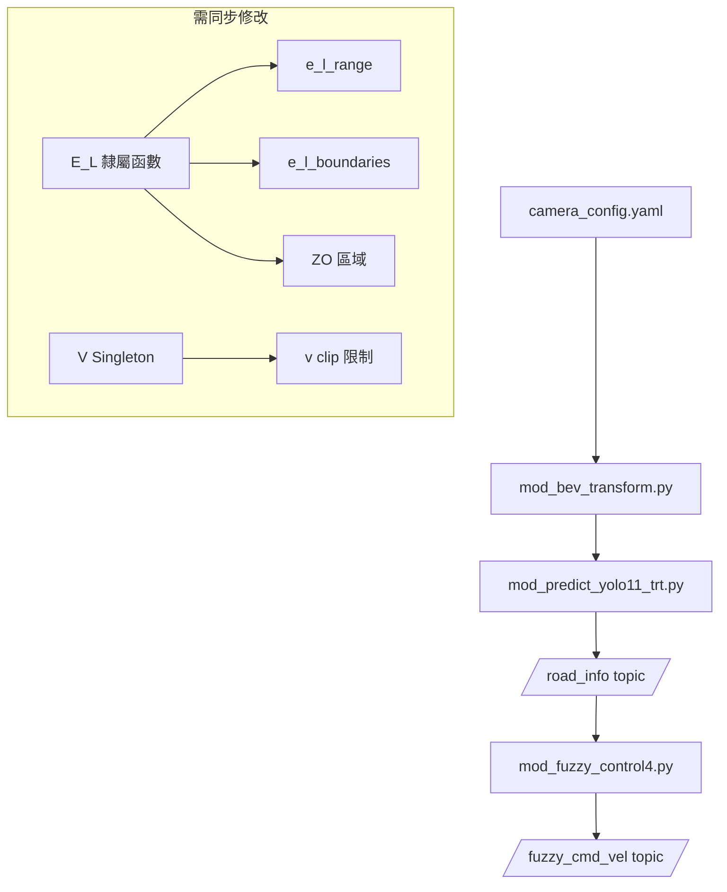

# 專案參數設定指南

本文件說明各模組中需要注意的關鍵參數及其相依性。

---

## 1. 模糊控制器 (`mod_fuzzy_control4.py`)

### 1.1 隸屬函數

#### 前方距離誤差 E_D (`MembershipFunctions.E_D`)
| 語言變數 | 範圍 (a, b, c) | 說明 |
|---------|---------------|------|
| VN | (0.0, 0.0, 0.52) | 非常近（危險） |
| N | (0.0, 0.52, 1.04) | 近 |
| M | (0.52, 1.04, 1.56) | 中等 |
| F | (1.04, 1.56, 2.08) | 遠 |
| VF | (1.56, 2.08, 2.08) | 非常遠（安全） |

#### 橫向誤差 E_L (`MembershipFunctions.E_L`)
| 語言變數 | 範圍 (a, b, c) | 說明 |
|---------|---------------|------|
| NB | (-1.0, -0.5, -0.20) | 左偏大 |
| NS | (-0.5, -0.20, 0.0) | 左偏小 |
| ZO | (-0.10, 0.0, 0.10) | 置中（縮小死區提高敏感度） |
| PS | (0.0, 0.20, 0.5) | 右偏小 |
| PB | (0.20, 0.5, 1.0) | 右偏大 |

> [!IMPORTANT]
> 修改 E_L 時，須同步更新 `mod_bev_transform.py` 中的：
> - `e_l_range` 預設值（第 113 行）
> - `e_l_boundaries` 繪製邊界（第 453-458 行）
> - ZO 區域範圍（第 467-468 行）

### 1.2 輸出 Singleton

#### 線速度 V (`MembershipFunctions.V`)
| 語言變數 | 值 (m/s) |
|---------|---------|
| S | 0.0 |
| VS | 0.15 |
| SL | 0.3 |
| M | 0.45 |
| F | 0.6 |

> [!IMPORTANT]
> 修改 V 最大值時，須同步更新第 267 行的 `np.clip(v, 0.0, X)` 限制。

#### 角速度 OMEGA (`MembershipFunctions.OMEGA`)
| 語言變數 | 值 (rad/s) |
|---------|-----------|
| NB | -1.0 (右轉大) |
| NS | -0.5 |
| ZO | 0.0 |
| PS | 0.5 |
| PB | 1.0 (左轉大) |

### 1.3 低通濾波器

輸出經過指數移動平均（EMA）濾波以減緩頓挫和擺動。

```python
# 濾波公式: filtered = alpha * current + (1 - alpha) * previous
alpha_v = 0.4       # 線速度濾波係數
alpha_omega = 0.6   # 角速度濾波係數
```

| 參數 | 調整效果 |
|------|---------|
| alpha 越小 | 濾波越強，反應越慢，越平滑 |
| alpha 越大 | 濾波越弱，反應越快，越敏感 |

> [!TIP]
> 如果移動太頓挫 → 降低 `alpha_v`（如 0.2）
> 如果左右擺動 → 降低 `alpha_omega`（如 0.3）
> 如果反應太遲鈍 → 提高對應的 alpha 值

---

## 2. BEV 轉換器 (`mod_bev_transform.py`)

### 2.1 關鍵配置檔
- 位置：`config/camera_config.yaml`
- 包含相機內外參、安全距離、感測範圍

### 2.2 需同步的參數
| 參數 | 位置 | 相依模組 |
|------|------|---------|
| `e_l_range` | 第 113 行 | `mod_fuzzy_control4.py` E_L |
| `e_l_boundaries` | 第 453-458 行 | `mod_fuzzy_control4.py` E_L |
| ZO 區域 | 第 467-468 行 | E_L 的 ZO 範圍 |

---

## 3. YOLO 檢測器 (`mod_predict_yolo11_trt.py`)

### 3.1 橫向參考點距離
```python
# 第 544 行
lateral_ref_distance = 1.1  # 公尺（停止距離附近）
```
- 用於計算橫向誤差 e_l 的採樣位置
- 值越大 → 越早偵測橫向偏差

### 3.2 預設參數
| 參數 | 預設值 | 說明 |
|------|--------|------|
| `conf_thres` | 0.5 | 置信度閾值 |
| `iou_thres` | 0.5 | NMS IOU 閾值 |
| `max_det` | 1 | 最大檢測數量 |
| `imgsz` | 640 | 推論圖像尺寸 |

---

## 4. 相機配置 (`config/camera_config.yaml`)

### 4.1 關鍵參數
```yaml
camera_extrinsics:
  pitch_deg: 29.0        # 俯仰角（度）
  height_m: 0.168        # 相機高度（公尺）

safety:
  stop_distance_m: 1.04  # 停止距離（公尺）

sensing_range:
  min_distance_from_camera_m: 0.45
  max_distance_from_camera_m: 3.25
```

> [!WARNING]
> 修改 `stop_distance_m` 會影響前方距離誤差 e_d 的計算。

---

## 5. 參數相依關係圖



---

## 6. 快速檢查清單

修改模糊邏輯時，確認以下項目：

- [ ] `mod_fuzzy_control4.py` - 隸屬函數定義
- [ ] `mod_fuzzy_control4.py` - 輸出 clip 限制
- [ ] `mod_bev_transform.py` - `e_l_range` 預設值
- [ ] `mod_bev_transform.py` - BEV 繪製邊界
- [ ] `mod_predict_yolo11_trt.py` - `lateral_ref_distance`
- [ ] `config/camera_config.yaml` - 安全距離設定
