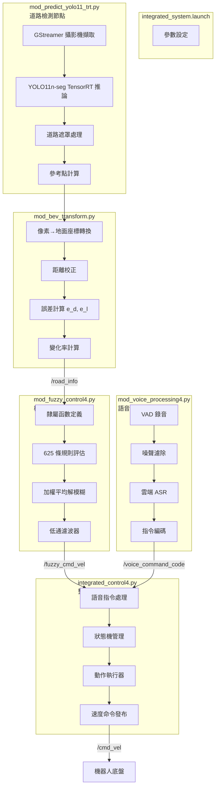
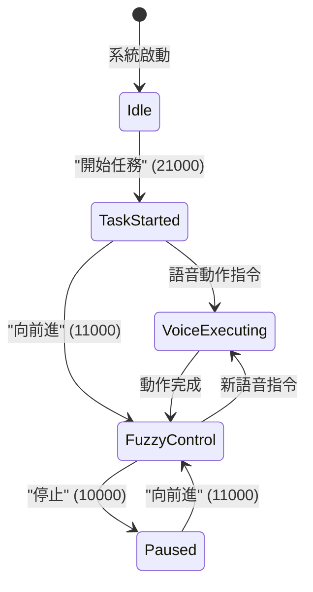
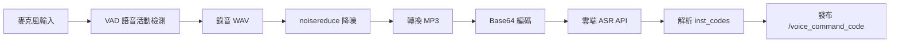

# ROS 機器人視覺導引避障系統 - 專案架構分析報告

## 系統概述

此專案為基於 ROS (Robot Operating System) 的**室內走廊自主導航機器人**，整合了：
- **YOLO11 深度學習道路分割**（TensorRT 加速）
- **鳥瞰圖 (BEV) 座標轉換**
- **四輸入模糊邏輯控制器**
- **語音指令處理**

機器人透過視覺分析走廊/道路邊界，利用模糊控制器計算線速度與角速度，實現**走廊跟隨與避障**功能。

---

## 系統架構圖



---

## 模組詳細說明

### 1. 啟動檔案 `integrated_system.launch`

| 節點名稱 | 執行腳本 | 功能 |
|---------|---------|------|
| `road_detection_node` | `mod_predict_yolo11_trt.py` | YOLO11 道路分割 |
| `fuzzy_controller_node` | `mod_fuzzy_control4.py` | 4 輸入模糊控制 |
| `voice_command_node` | `mod_voice_processing4.py` | 語音指令處理 |
| `integrated_controller_node` | `integrated_control4.py` | 整合控制中樞 |
| `fuzzy_data_logger`（可選）| `fuzzy_data_logger.py` | 模糊控制資料記錄 |

---

### 2. 道路檢測節點 `mod_predict_yolo11_trt.py`

#### 2.1 核心功能
- 使用 **YOLO11n-seg** 模型（TensorRT 引擎）進行走廊/道路實例分割
- 即時處理 640×480 解析度影像，達成 **~30 FPS**
- 輸出道路遮罩與兩個關鍵參考點

#### 2.2 主要類別

```python
class YOLO11RoadDetector:
    """YOLO11 道路檢測器"""
    
    def __init__(self, weights_path, conf_thres=0.5, max_det=1, ...):
        # 載入 TensorRT 引擎
        self.model = YOLO(weights_path, task="segment")
        # GStreamer 相機擷取
        self.cap = cv2.VideoCapture(pipeline, cv2.CAP_GSTREAMER)
    
    def predict(self, frame) -> results:
        """執行 YOLO 推論"""
    
    def process_masks(self, results, frame):
        """處理分割遮罩，計算參考點"""
        # 回傳: mask_img, forward_ref, lateral_ref
```

#### 2.3 參考點計算邏輯

| 參考點 | 用途 | 計算方式 |
|--------|------|----------|
| **前方參考點** (藍色) | 計算 `e_d` 前方距離誤差 | 影像水平中心線與遮罩最高交點 |
| **橫向參考點** (黃色) | 計算 `e_l` 橫向誤差 | 固定高度（停止距離處）的遮罩中心點 |

#### 2.4 發布的 ROS Topics

| Topic | 類型 | 內容 |
|-------|------|------|
| `/road_info` | `Float32MultiArray` | `[detected, e_d, e_d_dot, e_l, e_l_dot, y_ground, x_ground]` |
| `/avoidance_enabled` | `String` | `"enabled"` / `"disabled"` |

---

### 3. BEV 座標轉換模組 `mod_bev_transform.py`

#### 3.1 核心功能
- 將影像像素座標轉換為地面實際座標（公尺）
- 基於相機內參、外參與俯仰角進行幾何投影
- 計算模糊控制器所需的 4 個輸入變數

#### 3.2 相機配置參數（來自 `camera_config.yaml`）

```yaml
camera_intrinsics:
  width: 640
  height: 480
  fx: 618.93    # 焦距
  fy: 619.87
  cx: 326.48    # 主點
  cy: 243.02

camera_extrinsics:
  pitch_deg: 29.0    # 俯仰角（向下）
  height_m: 0.345    # 相機高度

safety:
  stop_distance_m: 1.1   # 停止距離
```

#### 3.3 座標轉換公式

```python
def pixel_to_ground(self, u, v):
    # 1. 計算像素偏角
    alpha = arctan2((u - cx), fx)   # 水平偏角
    beta = arctan2((v - cy), fy)    # 垂直偏角
    
    # 2. 計算總俯仰角
    total_pitch = pitch_rad + beta
    
    # 3. 計算前方距離
    y_raw = camera_height / tan(total_pitch)
    
    # 4. 應用校正（二次多項式擬合）
    y_ground = polyval(correction_coeffs, y_raw)
    x_ground = slant_distance * tan(alpha) * lateral_correction
    
    return x_ground, y_ground
```

#### 3.4 誤差定義

| 變數 | 說明 | 範圍 |
|------|------|------|
| `e_d` | 前方距離誤差 = y_ground - stop_distance | [0, 2.08] m |
| `e_d_dot` | 前方距離變化率 | [-2.08, 2.08] m/s |
| `e_l` | 橫向誤差（左負右正）| [-0.5, 0.5] m |
| `e_l_dot` | 橫向變化率 | [-1.0, 1.0] m/s |

---

### 4. 模糊控制節點 `mod_fuzzy_control4.py`

#### 4.1 控制器規格

| 項目 | 說明 |
|------|------|
| 輸入變數 | 4 個：`e_d`, `e_d_dot`, `e_l`, `e_l_dot` |
| 輸出變數 | 2 個：`v`（線速度）, `ω`（角速度）|
| 語言變數 | 每輸入 5 個等級 → 5⁴ = **625 條規則** |
| 推論方法 | Mamdani, MIN-MAX |
| 解模糊 | 加權平均法（Weighted Average） |

#### 4.2 隸屬函數定義

**輸入變數隸屬函數（三角形）：**

```python
# e_d (前方距離誤差) [0, 2.08]
E_D = {
    'VN': (0.0, 0.0, 0.52),    # Very Near (危險)
    'N':  (0.0, 0.52, 1.04),   # Near
    'M':  (0.52, 1.04, 1.56),  # Medium
    'F':  (1.04, 1.56, 2.08),  # Far
    'VF': (1.56, 2.08, 2.08)   # Very Far (安全)
}

# e_l (橫向誤差) [-0.5, 0.5]
E_L = {
    'NB': (-1.0, -0.5, -0.20),  # 左偏大
    'NS': (-0.5, -0.20, 0.0),   # 左偏小
    'ZO': (-0.10, 0.0, 0.10),   # 零（死區 ±0.10m）
    'PS': (0.0, 0.20, 0.5),     # 右偏小
    'PB': (0.20, 0.5, 1.0)      # 右偏大
}
```

**輸出變數（Singleton）：**

```python
V = {                         # 線速度 (m/s)
    'S': 0.0,    # Stop
    'VS': 0.15,  # Very Slow
    'SL': 0.3,   # Slow
    'M': 0.45,   # Medium
    'F': 0.6     # Fast
}

OMEGA = {                     # 角速度 (rad/s)
    'NB': -2.0,  # 右轉大
    'NS': -1.0,  # 右轉小
    'ZO': 0.0,   # 直行
    'PS': 1.0,   # 左轉小
    'PB': 2.0    # 左轉大
}
```

#### 4.3 推論流程

```python
def compute(self, e_d, e_d_dot, e_l, e_l_dot):
    # 1. 模糊化
    mu_e_d = get_membership(e_d, E_D)
    mu_e_l = get_membership(e_l, E_L)
    ...
    
    # 2. 規則評估
    for rule in rules:
        firing_strength = min(mu_e_d[rule.e_d], mu_e_d_dot[rule.e_d_dot],
                              mu_e_l[rule.e_l], mu_e_l_dot[rule.e_l_dot])
        v_numerator += firing_strength * V[rule.v]
        v_denominator += firing_strength
        ...
    
    # 3. 解模糊
    v = v_numerator / v_denominator
    omega = omega_numerator / omega_denominator
    
    # 4. 速度耦合增益（低速抑制角速度）
    velocity_gain = base + (v/v_max)² * scale
    omega = omega * velocity_gain * distance_gain
    
    # 5. 低速硬限制
    if v < 0.15:
        omega *= 0.65  # VS band 衰減 35%
    
    # 6. 低通濾波
    v = α_v * v + (1 - α_v) * prev_v
    omega = α_ω * omega + (1 - α_ω) * prev_omega
    
    return v, omega
```

#### 4.4 關鍵參數

| 參數 | 值 | 說明 |
|------|-----|------|
| `alpha_v` | 0.3 | 線速度低通濾波係數 |
| `alpha_omega` | 0.65 | 角速度低通濾波係數 |
| `v_omega_coupling_base` | 0.18 | 速度耦合基準增益 |
| `v_omega_coupling_scale` | 1.0 | 速度耦合幅度增益 |

---

### 5. 整合控制節點 `integrated_control4.py`

#### 5.1 核心功能
- **狀態機管理**：協調語音指令與模糊控制的優先權
- **動作執行器**：解析語音編碼並執行對應動作
- **速度融合**：將語音動作與模糊避障輸出整合

#### 5.2 狀態轉換



#### 5.3 語音指令編碼格式

```
[設備碼 1位][動作碼 1位][參數碼 3位]
```

| 編碼 | 動作 | 說明 |
|------|------|------|
| `10000` | 停止 | 暫停所有動作 |
| `11000` | 向前進 | 啟動模糊避障 |
| `13000` | 左轉 90° | 定速旋轉 |
| `14000` | 右轉 90° | 定速旋轉 |
| `15000` | 左轉後前進 | 轉彎後啟動避障 |
| `16000` | 右轉後前進 | 轉彎後啟動避障 |
| `21000` | 左右觀察 | 左 90° → 右 180° → 左 90° |

#### 5.4 訂閱與發布

**訂閱：**
| Topic | 類型 | 來源 |
|-------|------|------|
| `/road_info` | `Float32MultiArray` | 道路檢測節點 |
| `/fuzzy_cmd_vel` | `Twist` | 模糊控制節點 |
| `/voice_command_code` | `String` | 語音處理節點 |
| `/avoidance_enabled` | `String` | 鍵盤控制 |

**發布：**
| Topic | 類型 | 說明 |
|-------|------|------|
| `/cmd_vel` | `Twist` | 底盤速度命令 |
| `/system_status` | `String` | 系統狀態廣播 |

---

### 6. 語音處理節點 `mod_voice_processing4.py`

#### 6.1 處理流程



#### 6.2 VAD 參數

| 參數 | 值 | 說明 |
|------|-----|------|
| `SILENCE_THRESHOLD` | 1000 | RMS 靜音閾值 |
| `SPEECH_START_THRESHOLD` | 5 | 連續語音幀數啟動錄音 |
| `SPEECH_END_THRESHOLD` | 10 | 連續靜音幀數結束錄音 |
| `MAX_RECORDING_SECONDS` | 5 | 最長錄音時間 |

#### 6.3 測試模式

在 `test_mode=True` 時支援鍵盤模擬：

| 按鍵 | 編碼 | 動作 |
|------|------|------|
| 0 | 10000 | 停止 |
| 1 | 21000 | 開始任務 |
| 2 | 11000 | 前進 |
| 3 | 13000 | 左轉 |
| 4 | 14000 | 右轉 |
| 5 | 15000 | 左轉前進 |
| 6 | 16000 | 右轉前進 |

---

## ROS Topic 資料流

```mermaid
graph LR
    subgraph 感測
        CAM[Camera]
        MIC[Microphone]
    end
    
    subgraph 處理
        YOLO[道路檢測]
        BEV[BEV 轉換]
        Fuzzy[模糊控制]
        Voice[語音處理]
    end
    
    subgraph 控制
        Integrated[整合控制]
        Robot[/cmd_vel]
    end
    
    CAM --> YOLO
    YOLO -->|/road_info| BEV
    BEV --> Fuzzy
    Fuzzy -->|/fuzzy_cmd_vel| Integrated
    MIC --> Voice
    Voice -->|/voice_command_code| Integrated
    Integrated --> Robot
```

---

## 關鍵設計決策

### 為何使用雙參考點？
- **前方參考點**：固定在影像中心垂直線上，確保 `e_d` 反映正前方障礙距離
- **橫向參考點**：固定在停止距離高度，確保 `e_l` 反映機器人當前位置相對於走廊中心的偏移

### 為何使用速度耦合增益？
- 低速時角速度過大會導致機器人**擺動**
- 透過 `ω = ω × f(v)` 使低速時角速度自動衰減

### 為何使用低通濾波？
- 模糊控制輸出可能有**高頻抖動**
- 指數移動平均 (EMA) 平滑輸出，提升行駛舒適度

---

## 參數調整指南

| 調整目標 | 相關參數 | 建議方向 |
|----------|----------|----------|
| 反應更靈敏 | `alpha_v`, `alpha_omega` | 增大（趨近 1.0）|
| 行駛更平滑 | `alpha_v`, `alpha_omega` | 減小（趨近 0.1）|
| 增加轉向能力 | `v_omega_coupling_base` | 增大 |
| 減少低速擺動 | VS band 衰減係數 | 減小（如 0.5）|
| 擴大死區 | `E_L['ZO']` 範圍 | 擴大（如 ±0.15）|

---

## 結論

此系統透過模組化設計實現了**視覺導引的室內走廊自主導航**：

1. **YOLO11 + TensorRT**：高效能道路分割（~30 FPS on Jetson）
2. **BEV 轉換**：精確的像素到地面座標映射
3. **4 輸入模糊控制**：625 條規則涵蓋各種情境
4. **語音指令整合**：支援遠端/本地語音控制
5. **狀態機管理**：協調多種控制模式的優先權

系統已在實際走廊環境中驗證，能夠穩定跟隨走廊中心並避開障礙物。
